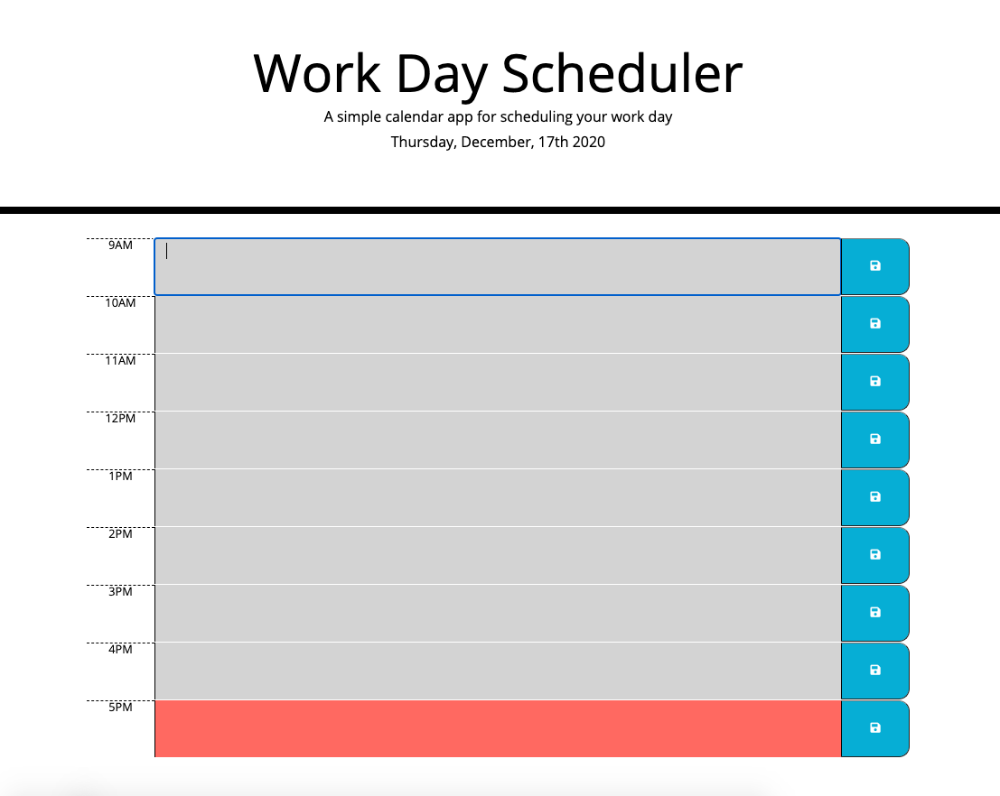
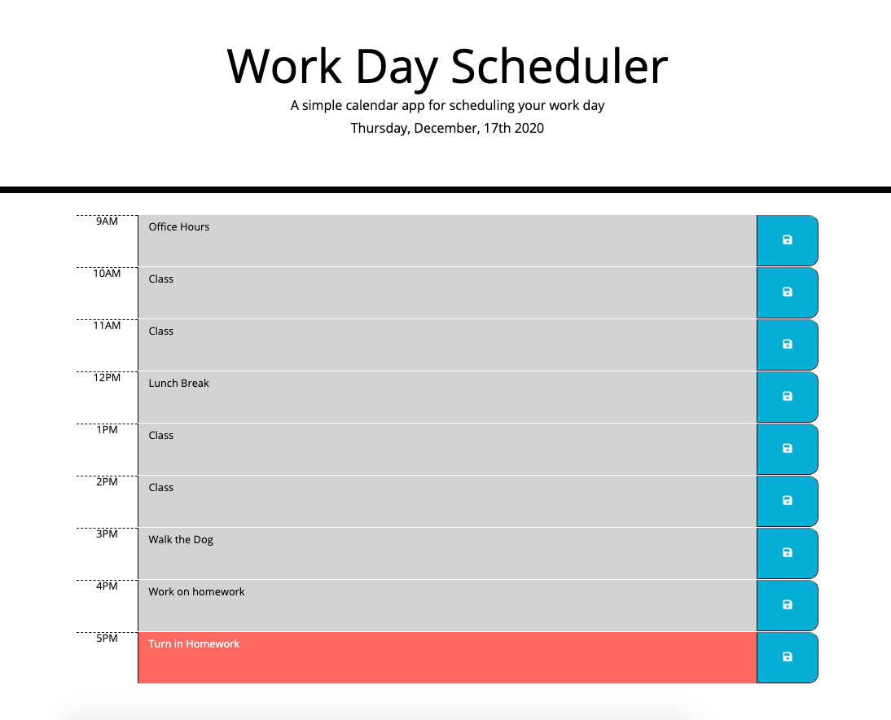

# Day Planner
This webpage features a simple day planner for the average work hours of 9AM - 5PM. The developer was provided with the CSS styling as well as a basic outline of HTML content and was tasked with creating dynamic content with jQuery. This website was created using moment.js which is *not* considered the best modern practice for tracking time.

# Installation
No installation is necessary. The user can access all the Day Planner features at the [deployed website](https://mollymccollumwx.github.io/day-planner/). The code for this webpage can be found at [Github](https://github.com/mollymccollumwx/day-planner). 

# Usage
When the webpage loads, the user is greeted with a schedule with times from 9AM to 5PM. The current hour of the day is highlighted in red, past hours are grey, and future hours are green. 

The user can save an event or task to the schedule by using the blue save button on the right. That information is stored in local storage and will persist on the page. 

# Credits

This webpage was created while enrolled at the Georgia Tech Coding Bootcamp. Contributors include TAs and tutors who helped debug the code.

# License 

MIT License

Copyright (c) [2020] [Molly M]

Permission is hereby granted, free of charge, to any person obtaining a copy of this software and associated documentation files (the "Software"), to deal in the Software without restriction, including without limitation the rights to use, copy, modify, merge, publish, distribute, sublicense, and/or sell copies of the Software, and to permit persons to whom the Software is furnished to do so, subject to the following conditions:

The above copyright notice and this permission notice shall be included in all copies or substantial portions of the Software.

THE SOFTWARE IS PROVIDED "AS IS", WITHOUT WARRANTY OF ANY KIND, EXPRESS OR IMPLIED, INCLUDING BUT NOT LIMITED TO THE WARRANTIES OF MERCHANTABILITY, FITNESS FOR A PARTICULAR PURPOSE AND NONINFRINGEMENT. IN NO EVENT SHALL THE AUTHORS OR COPYRIGHT HOLDERS BE LIABLE FOR ANY CLAIM, DAMAGES OR OTHER LIABILITY, WHETHER IN AN ACTION OF CONTRACT, TORT OR OTHERWISE, ARISING FROM, OUT OF OR IN CONNECTION WITH THE SOFTWARE OR THE USE OR OTHER DEALINGS IN THE SOFTWARE.